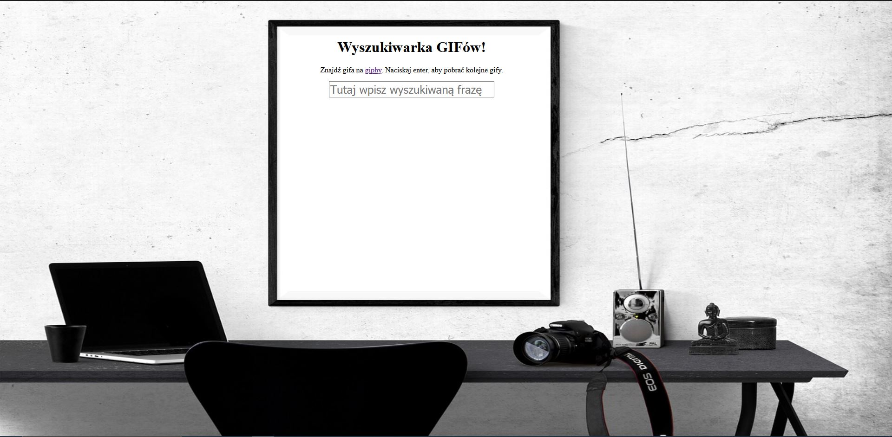

# Search_Engine_GIF

## Table of contents
* [General info](#general-info)
* [Screenshots](#screenshots)
* [Technologies](#technologies)
* [Contact](#contact)

## General info
Zadanie wykonane w ramach bootcampu Kodilla - "Web Developer".

Opis: Przećwiczenie tworzenia komponentów w React za pomocą składni preprocesora JSX.
Efektem zadania jest wyszukiwarka gifów pobierająca obrazki przez API (https://developers.giphy.com).

## Screenshots

## Technologies

   * HTML 5
   * CSS 3
   * Sass
   * React
   * JavaScript
   * AJAX
   * JSX

## Code Examples

App = React.createClass({
  getInitialState() {
    return {
      loading: false,
      searchingText: "",
      gif: {},
    };
  },

  handleSearch: function (searchingText) {
    this.setState({
      loading: true,
    });

    var self = this;
    this.getGif(searchingText)
      .then(function (gif) {
        self.setState({
          loading: false,
          gif: gif,
          searchingText: searchingText,
        });
      })

      .catch(function (error) {
        console.log(error);
      });
  },

## Contact
Created by me - feel free to contact me!
